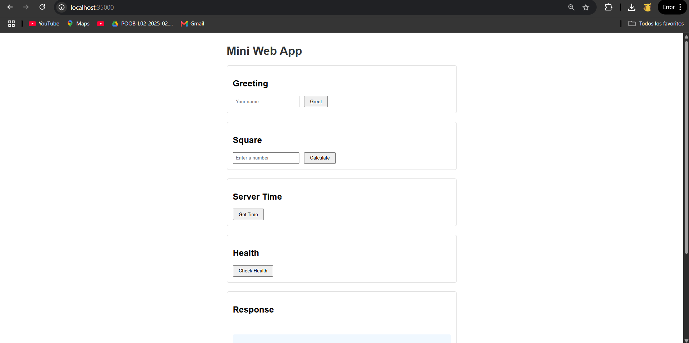
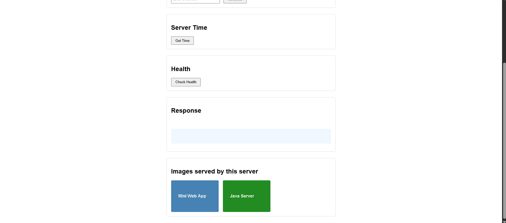
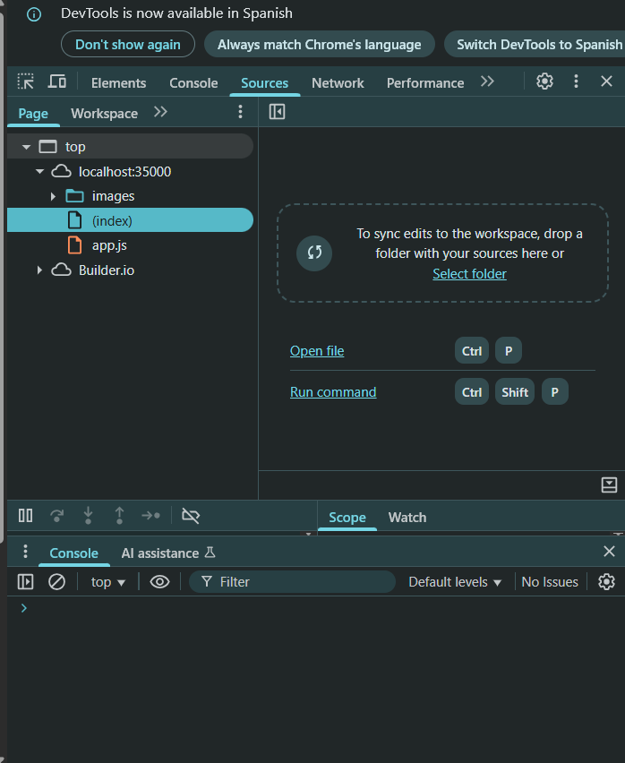
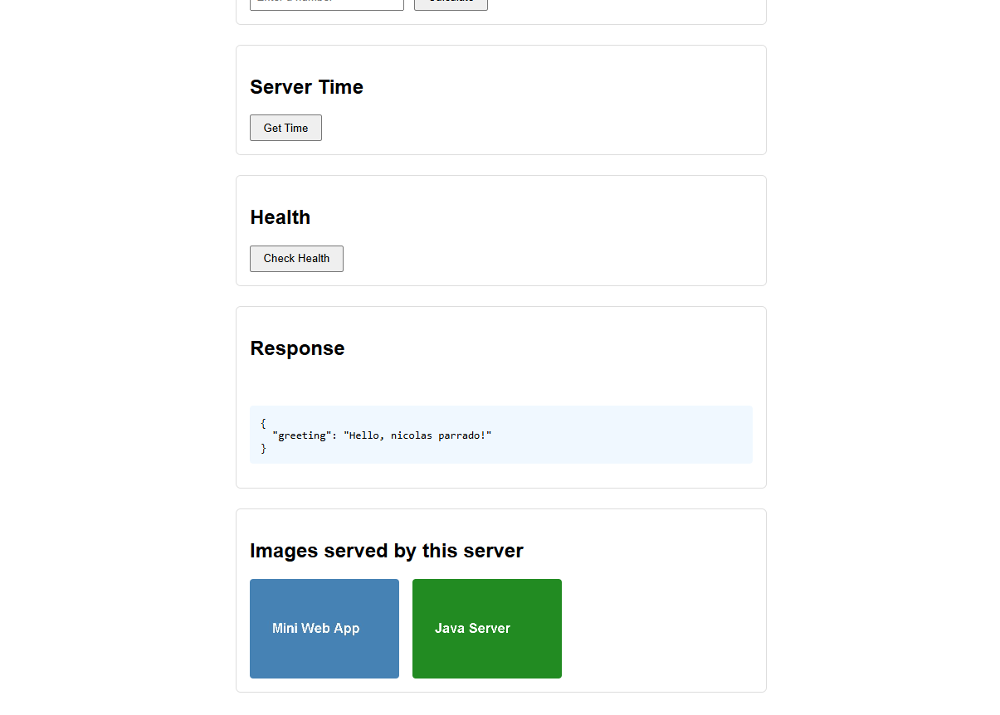
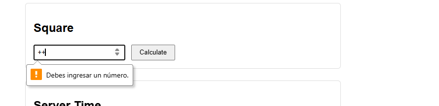
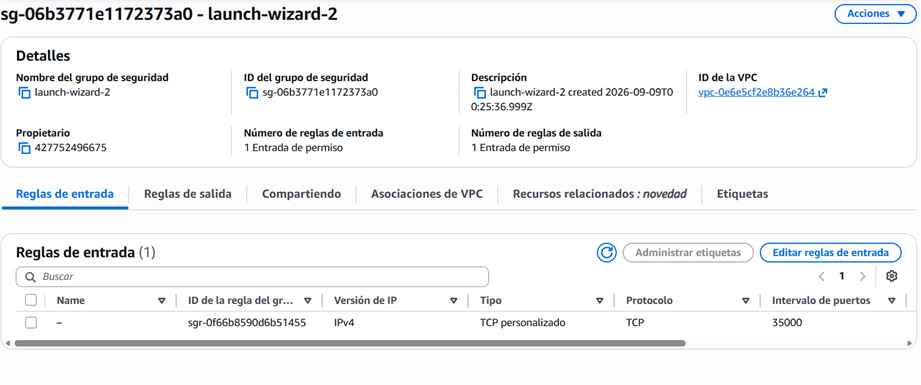
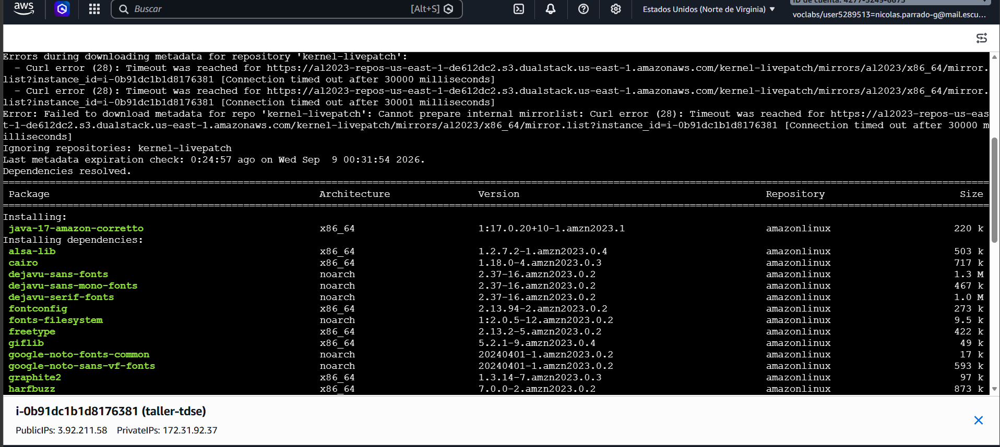

# Mini Web Application — Networking Lab Part 2

Servidor HTTP hecho con sockets de Java que sirve archivos estáticos y tiene unos servicios JSON hardcodeados. Se despliega en una instancia EC2 de AWS.

---

## ¿Qué hace?

Es una aplicación web pequeña que corre en un solo hilo. El servidor atiende una conexión a la vez: recibe la petición, responde, y ahí sí atiende la siguiente. No hay concurrencia, eso es intencional para entender el comportamiento base antes de agregar threads.

---

## Metáfora del sistema

El servidor funciona como una **ventanilla de banco con un solo cajero**. Cada cliente llega, hace su trámite completo, y solo cuando termina entra el siguiente. No hay dos clientes siendo atendidos al mismo tiempo.

- El **browser** es el cliente que llega con una solicitud
- El **HTTP GET** es el formulario que entrega en ventanilla
- El **Security Group de EC2** es la puerta de entrada: solo deja pasar ciertos tipos de tráfico (puertos 22 y 35000)
- **WebApp.java** es el cajero: lee la petición, decide qué hacer, y entrega la respuesta
- Los **archivos estáticos** son documentos pre-impresos que el cajero saca de un archivador (`src/main/resources/static/`)
- Los **servicios `/api/`** son cálculos que el cajero hace en el momento: saludo, cuadrado, hora, estado
- **app.js** es el cliente sentado en la sala de espera: puede hacer otras cosas mientras espera la respuesta, pero el cajero sigue siendo uno solo

---

## Arquitectura

El servidor funciona como una ventanilla única: cada petición espera su turno, se atiende completa, y solo entonces entra la siguiente.

```
Browser
  │
  │  HTTP GET /index.html, /api/greeting?name=X, ...
  ▼
[ EC2 Security Group ]  →  solo puertos 35000 y 22
  │
  ▼
[ WebApp.java — loop secuencial con ServerSocket ]
  ├── Archivos estáticos  →  src/main/resources/static/
  │     index.html, app.js, photo1.jpg, photo2.png
  └── Servicios
        /api/health     →  {"status":"UP"}
        /api/time       →  {"time":"..."}
        /api/greeting   →  {"greeting":"Hello, <name>!"}
        /api/square     →  {"input":n,"square":n²}
```

- El browser carga la página y desde `app.js` hace fetch a los servicios sin recargar
- `WebApp.java` atiende todo: archivos y servicios, uno a la vez
- Las rutas están en un `switch` explícito, sin frameworks

---

## Decisiones de diseño

- **Secuencial a propósito**: para ver dónde está el límite antes de agregar concurrencia
- **Rutas hardcodeadas**: el `switch` hace visible qué path hace qué. Un framework lo ocultaría
- **Archivos como bytes**: tanto texto como imágenes se leen como bytes, así no hay corrupción de encoding
- **Protección path traversal**: se normaliza el path y se verifica que esté dentro del directorio estático con canonical path
- **Cliente asíncrono**: `fetch` no bloquea el browser, pero eso no hace al servidor concurrente

---

## Estructura

```
src/
├── main/
│   ├── java/networking/
│   │   ├── WebApp.java          # servidor principal (Lab Part 2)
│   │   ├── URLExample.java      # ejercicios 1 y 2: métodos URL + mini-browser
│   │   ├── TCPServer.java       # echo server TCP
│   │   ├── TCPClient.java       # echo client TCP
│   │   ├── SquareServer.java    # ejercicio 4.3.1
│   │   ├── FunctionServer.java  # ejercicio 4.3.2: sin/cos/tan
│   │   ├── HttpServer.java      # sección 4.4: una sola petición
│   │   ├── MultiHttpServer.java # ejercicio 4.5.1: múltiples peticiones
│   │   ├── UDPServer.java
│   │   ├── UDPClient.java
│   │   ├── UDPTimeServer.java
│   │   └── UDPTimeClient.java
│   └── resources/static/
│       ├── index.html
│       ├── app.js
│       └── images/
│           ├── photo1.jpg
│           └── photo2.png
└── test/java/networking/
    └── WebAppTest.java
pom.xml
```

---

## Requisitos

- Java 17+
- Maven 3.8+

---

## Build

```bash
git clone <repo-url>
cd taller_tdse_nicolas_parrado
mvn package
```

Genera `target/webserver.jar` y corre los tests.

---

## Correr local

```bash
java -jar target/webserver.jar
# puerto personalizado:
java -jar target/webserver.jar 8080
```

Abrir `http://localhost:35000` en el browser.

---

## Cómo usar la aplicación

Al abrir la página se muestran cuatro secciones. La página nunca se recarga. Los resultados aparecen en el área azul y los errores en rojo.

| Sección | Qué hacer | Respuesta esperada | Error posible |
|---|---|---|---|
| Greeting | Escribir un nombre y clic en Greet | `{"greeting":"Hello, <nombre>!"}` | Campo vacío → mensaje de error en rojo |
| Square | Escribir un número y clic en Calculate | `{"input":N,"square":N²}` | Texto no numérico → 400 del servidor |
| Server Time | Clic en Get Time | `{"time":"2024-..."}` con la hora del servidor | Fallo de red → mensaje de error |
| Health | Clic en Check Health | `{"status":"UP"}` | — |

Mientras espera la respuesta se muestra "Loading...". Un error HTTP (400, 404, 405) muestra el mensaje del servidor en rojo. Un fallo de red muestra "Network failure: ...".

---

## Servicios disponibles

| URL | Parámetro | Respuesta |
|---|---|---|
| `/api/health` | — | `{"status":"UP"}` |
| `/api/time` | — | `{"time":"..."}` |
| `/api/greeting?name=X` | name | `{"greeting":"Hello, X!"}` |
| `/api/square?value=N` | value | `{"input":N,"square":N²}` |

Errores:
- Parámetro faltante o inválido → 400
- Archivo no encontrado → 404
- Método no soportado → 405
- Path traversal → 400

---

## Tests

```bash
mvn test
```

Cubren: escape de JSON, parseo de query params, decodificación de URL encoding, y normalización de paths.

---

## Despliegue en EC2

1. Crear instancia EC2 con Amazon Linux 2023, tipo `t2.micro`
2. En el Security Group abrir puerto `22` (SSH) y `35000` (app)
3. Conectarse con EC2 Instance Connect desde la consola de AWS
4. Instalar Java:
```bash
sudo dnf install java-17-amazon-corretto -y
```
5. Subir el jar y los recursos desde la máquina local:
```bash
scp -i <key.pem> target/webserver.jar ec2-user@<EC2-IP>:~/
scp -i <key.pem> -r src/main/resources/static ec2-user@<EC2-IP>:~/src/main/resources/
```
6. Correr el servidor:
```bash
java -jar webserver.jar 35000
```
7. Abrir `http://<EC2-IP>:35000` en el browser

---

## Evidencia

### Local

#### Página principal cargada localmente
<!-- Browser en http://localhost:35000 mostrando index.html con las dos imágenes visibles -->



#### Network tab — recursos estáticos
<!-- F12 > Network > recargar: requests para index.html, app.js, photo1.jpg, photo2.png con status 200 y content-type correcto -->


#### Servicios funcionando
<!-- Resultado de greeting, square, time y health en el área de respuesta azul -->


#### Error controlado — número inválido
<!-- Mensaje de error en rojo al enviar texto en el campo Square -->


---

### EC2

#### Instancia EC2 creada
<!-- Consola AWS mostrando la instancia en estado running con su IP pública -->


#### Instalación de Java en la instancia
<!-- Terminal EC2 Instance Connect mostrando la instalación de java-17-amazon-corretto -->


---

## Limitación secuencial

Si dos browsers hacen peticiones al mismo tiempo, la segunda espera hasta que la primera termine. El `fetch` en JavaScript no bloquea el browser, pero el servidor Java sigue siendo de una petición a la vez.

---

## Limitaciones conocidas

- Una petición a la vez, sin threads
- Solo GET
- Rutas hardcodeadas
- Sin HTTPS ni autenticación

---

## Preguntas de reflexión

**1. ¿Por qué una sola página HTML genera varias peticiones HTTP?**
El browser descubre recursos adicionales en el HTML: el script, las imágenes y el favicon. Por cada uno genera una petición separada, así que una sola página produce al menos 4 requests.

**2. ¿Por qué las imágenes deben tratarse como bytes y no como texto?**
Las imágenes son datos binarios. Leerlas como texto corrompe los bytes que no corresponden a caracteres válidos. Leer y escribir como bytes garantiza que el contenido llega intacto al browser.

**3. ¿Cuál es el rol del Content-Type en la respuesta?**
Le dice al browser cómo interpretar los bytes recibidos: construir el DOM, ejecutar JavaScript, decodificar píxeles o parsear JSON. Sin él el browser adivina y puede mostrar basura.

**4. ¿Qué está hardcodeado en este diseño y qué generalizaría un framework?**
Está hardcodeado: las rutas en el `switch`, los nombres de parámetros, los mensajes de error y el mapeo de extensiones a content-types. Un framework generalizaría todo eso con anotaciones y configuración. El `switch` explícito hace visible exactamente qué path hace qué.

**5. ¿Por qué el browser puede seguir respondiendo mientras el servidor atiende secuencialmente?**
`fetch` es no bloqueante: lanza la petición y el browser sigue ejecutando código. El servidor es el que bloquea. La asincronía está en el cliente, no en el servidor.

**6. ¿Qué cambió al mover el servidor a EC2? ¿Qué no cambió?**
Cambió la IP, la red y el sistema operativo. No cambió el código, el comportamiento, ni la secuencialidad. EC2 cambia dónde corre el servidor, no cómo funciona.

**7. ¿Qué pasa cuando dos usuarios envían peticiones al mismo tiempo?**
El servidor atiende la primera completa antes de aceptar la siguiente. La segunda queda en la cola del sistema operativo esperando, sin importar cuánto tarde la primera.

**8. ¿Cuál es la siguiente limitación a resolver, y por qué la concurrencia va antes que el balanceo de carga?**
La secuencialidad. Agregar threads permite atender varias conexiones en la misma máquina sin costo extra. El balanceo de carga entre instancias no sirve si cada instancia sigue siendo de un hilo: primero hay que hacer eficiente una instancia, luego escalar.

---

## Autor

Nicolas Parrado — Escuela Colombiana de Ingeniería

**Reconocimientos:** contenido basado en los tutoriales de networking de [docs.oracle.com/javase/tutorial/networking](https://docs.oracle.com/javase/tutorial/networking) y en la guía del laboratorio de la Escuela Colombiana de Ingeniería.
